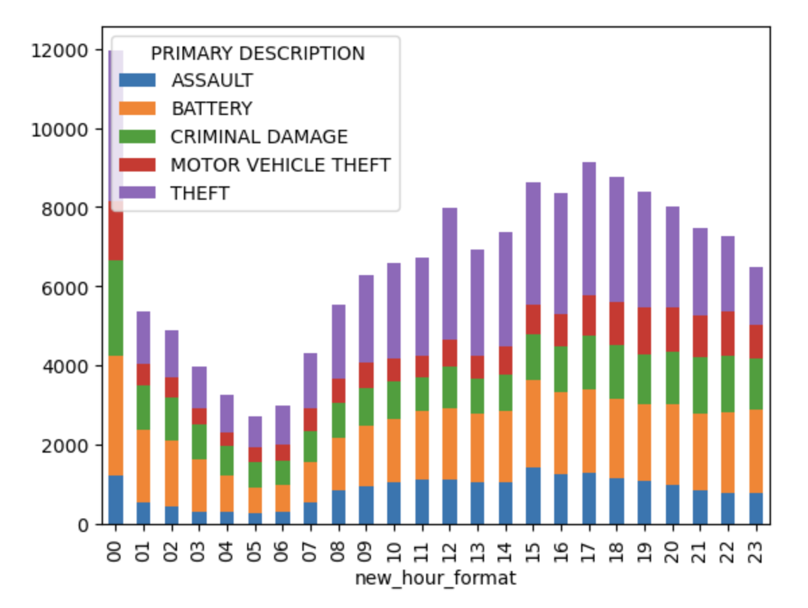
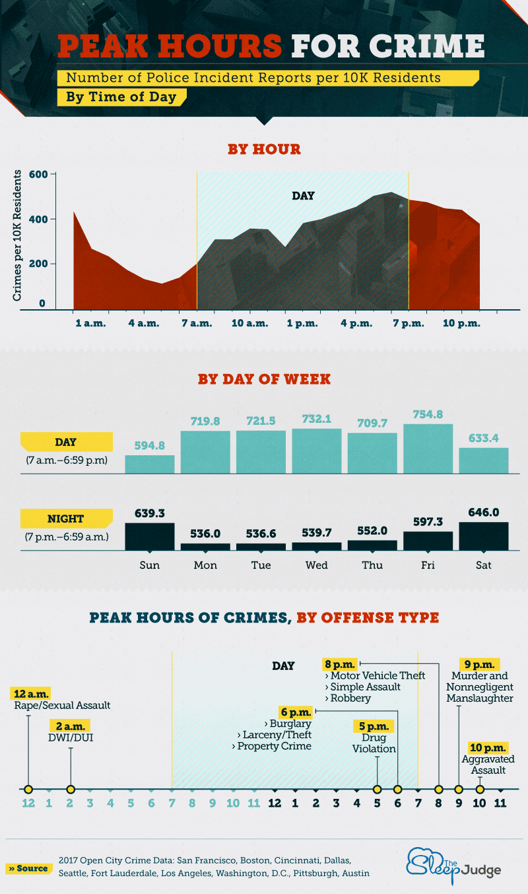
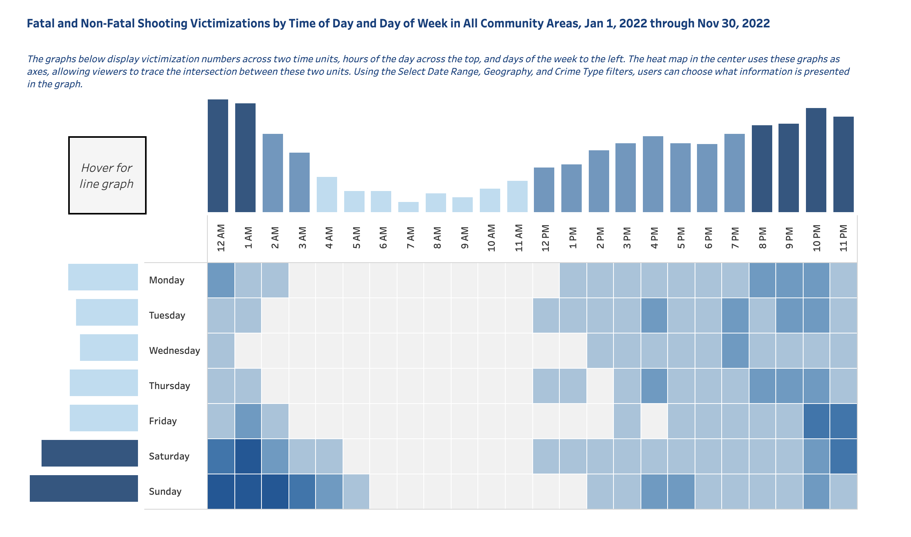

# Crime Distribution in Chicago

<b>Jaylen Mao, Weiyu Wang</b>

For the source dataset, we use [Crimes - One year prior to present](https://data.cityofchicago.org/Public-Safety/Crimes-One-year-prior-to-present/x2n5-8w5q/data) -- a dataset reflects reported incidents of crime (with the exception of murders where data exists for each victim) that occurred in the City of Chicago from over the past year, last updated on November 9, 2022

###### Licensing and Attribution
- Data Provided By: Chicago Police Department
- Source Link: http://www.chicagopolice.org/

## 1 Write up

In this article, we will show you the distribution of different types of crime events in two time units, based on Chicago crime event data for the last year. Users can use this Dashboard to understand the distribution of different crime types in different time dimensions, so as to build security awareness and prevent crime in advance. 

To achieve this visualization goal, We first found their data source for building crime incident maps by browsing spotcrime.com, the Chicago data portal at https://data.cityofchicago.org. We then searched for "crime" in the portal and found this dataset, and found two datasets They are called "Crimes - 2001 to Present" and "Crimes - One year prior to present", respectively. The former contains 7,669,219 pieces of data, which exceeds the file size limit of github, so we chose the latter.

After obtaining the dataset, we first processed and cleaned the dataset, and members of the team analyzed the data distribution in units of time for each day of the week and 24 hours of the day (final project part1), and then we built an interactive dashboard to give users more freedom to choose the specific type of crime or unit of time to view. In addition, users can choose what information is presented in the graph (final project part2). And then we linking this to the Jekyll vega-chart. And then we linking this to the Jekyll vega-chart. and deploying it to our github page, so that more users can access our visual dashboard directly through the link.

In addition, we have collected visualizations of crime incidents over time from other websites and different datasets that can help you learn more about the timing of crime incidents if you are browsing our visualization articles.

## 2 Static Visualization

## 3 Interactive Visualization

This dashboard is to explore the relationship, in an interactive way, between the number of dogs in each US state and the number of dogs per household on average.In the meanwhile, the dashboard also shows the cat population the selected states. Select the square area on the left with the mouse, and the corresponding histogram can be displayed interactively on the right.  

The diagram on the left is the driver diagram. It shows the average number of dogs per households by US state. Among them, the color of each square represents the total number of dogs in the state. The graph on the right is the driven graph, which represents the total number of cat for each state. And the bar chart was ordered by the total number. So when reader select a region in the left, the state which has most cat will be shown in the right. Different color indicates different states, so the readers can compare them vividly. 

<vegachart schema-url="{{ site.baseurl }}/assets/json/final.json" style="width: 60%"></vegachart>

## 4 Contextual visualization

[thesleepjudge.com](https://www.thesleepjudge.com/crimes-that-happen-while-you-sleep/) (source URL:https://www.thesleepjudge.com/crimes-that-happen-while-you-sleep/)

We could clearly check onto the plot to figure out the total preference with in a country over the world. For example, the United States residents seem to have more population that love dogs, while Canadians seem to prefer cats more in general.

[chicago.gov](https://www.chicago.gov/city/en/sites/vrd/home/violence-victimization.html) (source URL: https://www.chicago.gov/city/en/sites/vrd/home/violence-victimization.html)





