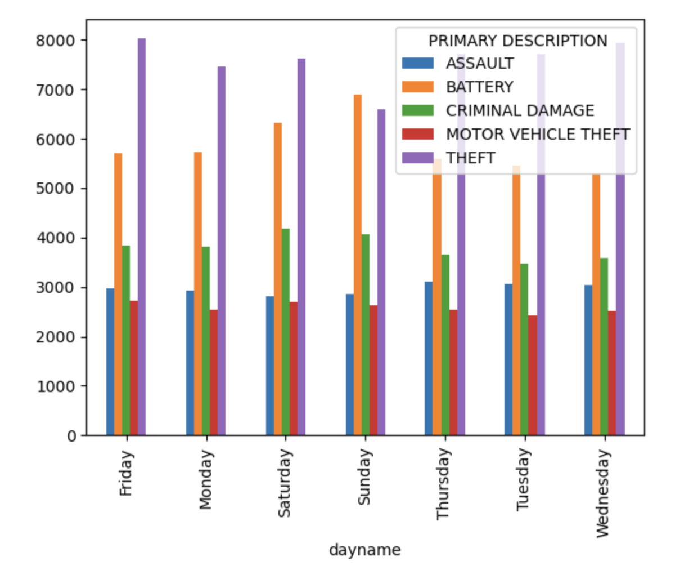

# Crime Distribution in Chicago

<b>Jaylen Mao, Weiyu Wang</b>

For the source dataset, we use [Crimes - One year prior to present](https://data.cityofchicago.org/Public-Safety/Crimes-One-year-prior-to-present/x2n5-8w5q/data) -- a dataset reflects reported incidents of crime (with the exception of murders where data exists for each victim) that occurred in the City of Chicago from over the past year, last updated on November 9, 2022

###### Licensing and Attribution
- Data Provided By: Chicago Police Department
- Source Link: [http://www.chicagopolice.org/](http://www.chicagopolice.org/)

## 1 Write up

In this article, we will show you the distribution of different types of crime events in two time units, based on Chicago crime event data for the last year. Users can use this Dashboard to understand the distribution of different crime types in different time dimensions, so as to build security awareness and prevent crime in advance. 

To achieve this visualization goal, We first found their data source for building crime incident maps by browsing spotcrime.com, the Chicago data portal at [https://data.cityofchicago.org](https://data.cityofchicago.org). We then searched for "crime" in the portal and found this dataset, and found two datasets They are called "Crimes - 2001 to Present" and "Crimes - One year prior to present", respectively. The former contains 7,669,219 pieces of data, which exceeds the file size limit of github, so we chose the latter.

After obtaining the dataset, we first processed and cleaned the dataset, and members of the team analyzed the data distribution in units of time for each day of the week and 24 hours of the day (final project part1), and then we built an interactive dashboard to give users more freedom to choose the specific type of crime or unit of time to view. In addition, users can choose what information is presented in the graph (final project part2). And then we linking this to the Jekyll vega-chart. And then we linking this to the Jekyll vega-chart. and deploying it to our github page, so that more users can access our visual dashboard directly through the link.

In addition, we have collected visualizations of crime incidents over time from other websites and different datasets that can help you learn more about the timing of crime incidents if you are browsing our visualization articles.

## 2 Static Visualization

For common crime like theft, Sunday has significant lower level than in other days. A possible reason might be that people usually stay at home on Sunday so it will increase the rick for thieves to break into house. However, battery raised significantly on Sundays and Saturdays because people may get drunk on weekend, conflicts and fights can increase.

A 24-hour analysis on common crime shows that theft usually happens on daytime when house owners are away from home. However, motor vehicle theft usually happens during nights, since people park their motor vehicle at home or on the street where security is worse than in covered parking lots. Moreover, crimes at 0:00 AM is abnormally high. This may be due to the lag between a crime that happened and recorded. Some crimes with no accurate time records might counted as 0:00 AM. Another interesting finding is that the crimes have a climax around 17:00 PM. This phenomenon worth more consideration and exploration.

## 3 Interactive Visualization

This dashboard provides an interactive exploration on crimes’ relation between Season(Month), time of days(Hours) and the category of crimes. The charts reflect the frequency of crimes in different months. Also, the charts also show the frequency of crimes on different daytime. Last but not least, the charts demonstrate the amounts of different kinds of crimes in an arbitrary period of time.

The chart on the top left is a bar chart of crime count in different months. The time range is adjustable by cursor dragging. To clear the selected time range, user can click on unselected area on the chart. The chart on the top right changes along with selected time period, which a bar chart about 24-hour crime count in same time period with previous chart. The chart on the bottom indicate the amount of crime in different categories. Still, the time period of the last chart is conform to selected time range in first chart.

<vegachart schema-url="{{ site.baseurl }}/assets/json/final.json" style="width: 60%"></vegachart>

## 4 Contextual visualization

[thesleepjudge.com](https://www.thesleepjudge.com/crimes-that-happen-while-you-sleep/) (source URL:https://www.thesleepjudge.com/crimes-that-happen-while-you-sleep/)

Beside our project, there are many other interesting visualizations about crimes in other metro cities. As we mention in 2nd part, there are peaks hours for crimes. When comparing their visualization with ours, 17: 00 PM is the common peaks hour. Moreover, the weekend has higher crime frequency, especially during nights. The most fantastic thing they have done is that they marked out the most significant offence type in crime peak ours, which allows the police pay their attention on right place.

[chicago.gov](https://www.chicago.gov/city/en/sites/vrd/home/violence-victimization.html) (source URL: https://www.chicago.gov/city/en/sites/vrd/home/violence-victimization.html)

Another visualization is also about the crime frequency in different hours in a day. However, this visualization mapped the crime records in a heatmap. Such visualization method makes the count of record more intuitive that users can easily compare and understand the crime distribution in one chart.





